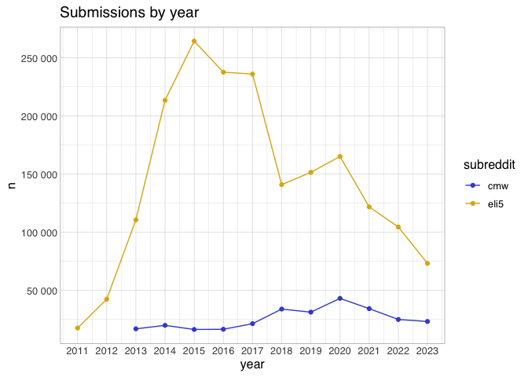
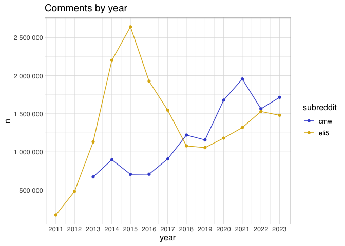
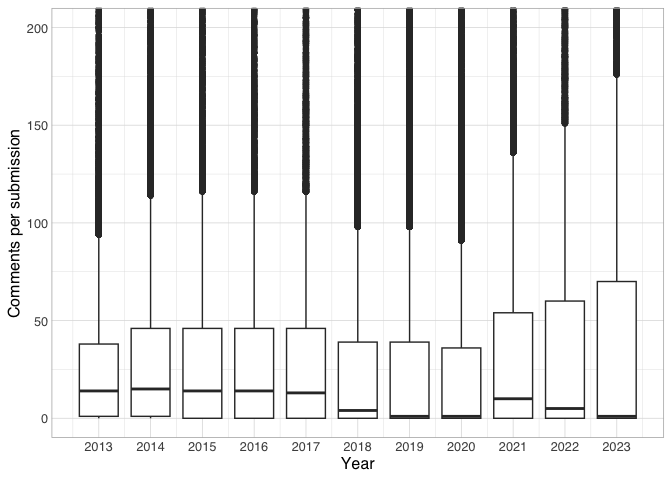
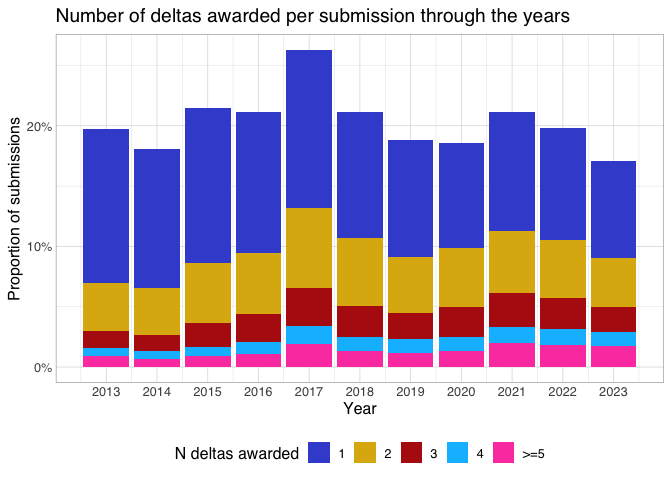
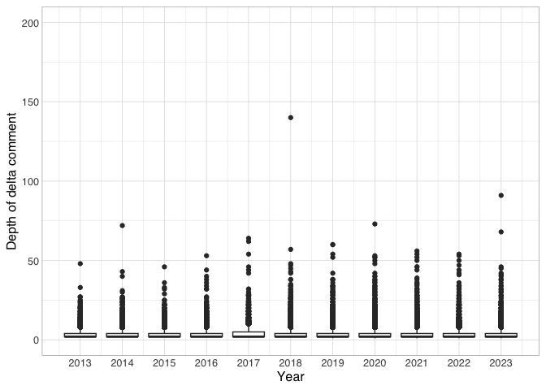

- [Counts of submissions and comments through
  time](#counts-of-submissions-and-comments-through-time)
- [Comments per submissions distribution through
  time](#comments-per-submissions-distribution-through-time)
- [Delta comment analyses](#delta-comment-analyses)

``` r
source(here::here("src/common_basis.R"))
```

    ## here() starts at /Users/jiemakel/tyo/disc

    ## ── Attaching core tidyverse packages ──────────────────────── tidyverse 2.0.0 ──
    ## ✔ dplyr     1.1.4     ✔ readr     2.1.5
    ## ✔ forcats   1.0.0     ✔ stringr   1.5.1
    ## ✔ ggplot2   3.5.1     ✔ tibble    3.2.1
    ## ✔ lubridate 1.9.3     ✔ tidyr     1.3.1
    ## ✔ purrr     1.0.2     
    ## ── Conflicts ────────────────────────────────────────── tidyverse_conflicts() ──
    ## ✖ dplyr::filter() masks stats::filter()
    ## ✖ dplyr::lag()    masks stats::lag()
    ## ℹ Use the conflicted package (<http://conflicted.r-lib.org/>) to force all conflicts to become errors
    ## 
    ## Attaching package: 'arrow'
    ## 
    ## 
    ## The following object is masked from 'package:lubridate':
    ## 
    ##     duration
    ## 
    ## 
    ## The following object is masked from 'package:utils':
    ## 
    ##     timestamp

# Counts of submissions and comments through time

``` r
cmw_submissions_c %>% 
  mutate(year=year(created_utc)) %>% 
  filter(year<2024L) %>%
  count(year) %>%
  mutate(subreddit="cmw") %>%
  collect() %>%
  union_all(
    eli5_submissions_c %>% 
      mutate(year=year(created_utc)) %>% 
      filter(year<2024L) %>%
      count(year) %>%
      mutate(subreddit="eli5") %>%
      collect()
  ) %>%
  ggplot(aes(x=year,y=n, color=subreddit)) +
  geom_line() +
  geom_point() +
  theme_hsci_discrete() +
  scale_y_continuous(labels=scales::number, breaks=seq(0,500000, by=50000)) +
  scale_x_continuous(breaks=2010:2023) +
  ggtitle("Submissions by year")
```

<!-- -->

``` r
cmw_comments_c %>% 
  mutate(year=year(created_utc)) %>% 
  filter(year<2024L) %>%
  count(year) %>%
  mutate(subreddit="cmw") %>%
  collect() %>%
  union_all(
    eli5_comments_c %>% 
      mutate(year=year(created_utc)) %>% 
      filter(year<2024L) %>%
      count(year) %>%
      mutate(subreddit="eli5") %>%
      collect()
  ) %>%  
  ggplot(aes(x=year,y=n, color=subreddit)) +
  geom_line() +
  geom_point() +
  theme_hsci_discrete() +
  scale_y_continuous(labels=scales::number, breaks=seq(0,5000000, by=500000)) +
  scale_x_continuous(breaks=2010:2023) +
  ggtitle("Comments by year")
```

<!-- -->

# Comments per submissions distribution through time

``` r
cmw_submissions_a %>%
  transmute(year=year(created_utc), num_comments) %>%
  filter(year<2024L) %>%
  ggplot(aes(x=year,group=year,y=num_comments)) +
  #geom_quasirandom() +
  geom_boxplot() +
  theme_hsci_discrete() +
  scale_y_continuous(labels=scales::number) +
  scale_x_continuous(breaks=2013:2023) +
  coord_cartesian(ylim=c(0,200)) +
  xlab("Year") +
  ylab("Comments per submission")
```

<!-- -->

# Delta comment analyses

``` r
cmw_delta_comments_a %>% 
  select(id=link_id) %>%
  count(id) %>% 
  right_join(
    cmw_submissions_a %>%
      mutate(year=year(created_utc)) %>%
      filter(year<2024L)
    , join_by(id)
  ) %>%
  replace_na(list(n=0)) %>%
  mutate(n=pmin(n,5)) %>%
  count(year,n, name="nn") %>%
  group_by(year) %>%
  mutate(prop=nn/sum(nn)) %>%
  ungroup() %>%
  filter(n>0) %>%
  collect() %>%
  mutate(n=if_else(n>=5,">=5",as.character(n)) %>% fct_relevel(">=5",after=Inf)) %>%
  ggplot(aes(x=year,y=prop,fill=n)) +
  geom_col() +
  theme_hsci_discrete() +
  theme(legend.position="bottom") +
  scale_y_continuous(labels=scales::percent) +
  scale_x_continuous(breaks=2013:2023) +
  labs(fill="N deltas awarded") +
  xlab("Year") +
  ylab("Proportion of submissions") +
  ggtitle("Number of deltas awarded per submission through the years")
```

    ## Warning: Missing values are always removed in SQL aggregation functions.
    ## Use `na.rm = TRUE` to silence this warning
    ## This warning is displayed once every 8 hours.

<!-- -->

``` r
delta_comment_depth <- tbl(con, sql("
WITH RECURSIVE delta_comment_ancestors AS (
    SELECT id, parent_id AS ancestor_id, 1 AS height 
    FROM cmw_delta_comments_a
  UNION ALL
    SELECT ca.id, c.parent_id AS ancestor_id, height + 1 AS height
    FROM delta_comment_ancestors ca, cmw_comments_a c
    WHERE ca.ancestor_id = c.id
),
delta_comment_depth AS (
  SELECT id, MAX(height) AS depth
  FROM delta_comment_ancestors
  GROUP BY id
)
SELECT * FROM delta_comment_depth
"))
delta_comment_depth %>%
  inner_join(cmw_comments_a, join_by(id)) %>%
  transmute(year=year(created_utc),depth) %>%
  filter(year<2024L) %>%
  ggplot(aes(x=year,group=year,y=depth)) +
  geom_boxplot() +
  theme_hsci_discrete() +
  scale_y_continuous(labels=scales::number) +
  scale_x_continuous(breaks=2013:2023) +
  coord_cartesian(ylim=c(0,200)) +
  xlab("Year") +
  ylab("Depth of delta comment")
```

<!-- -->
